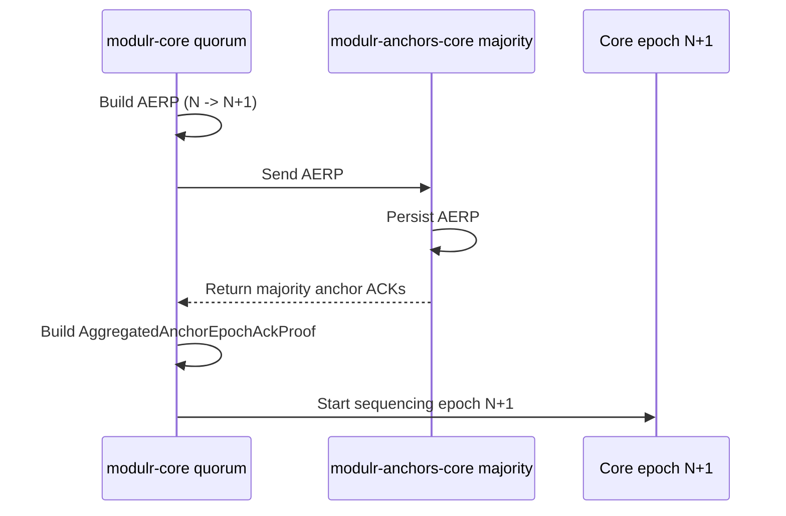
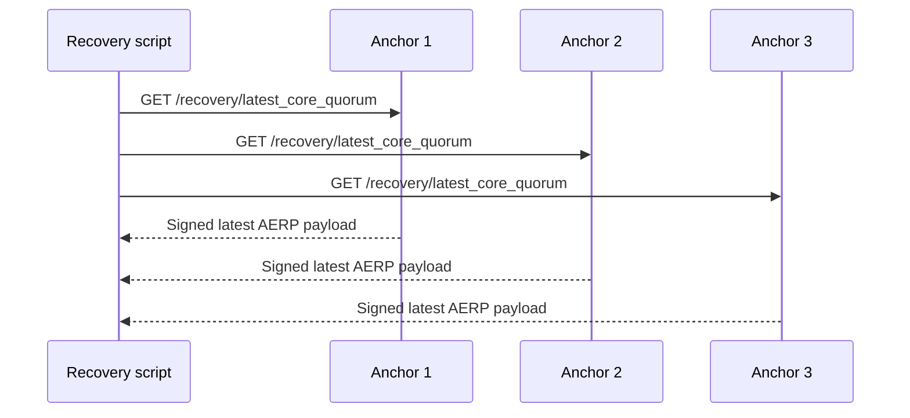
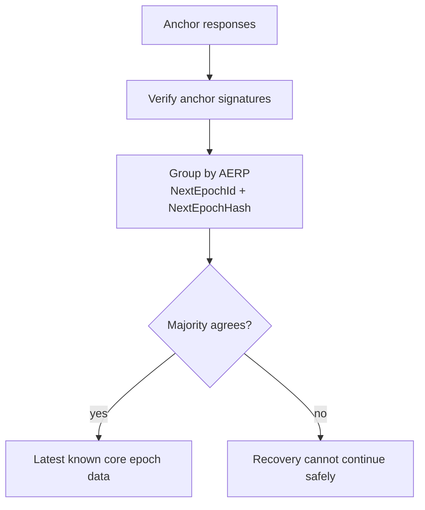
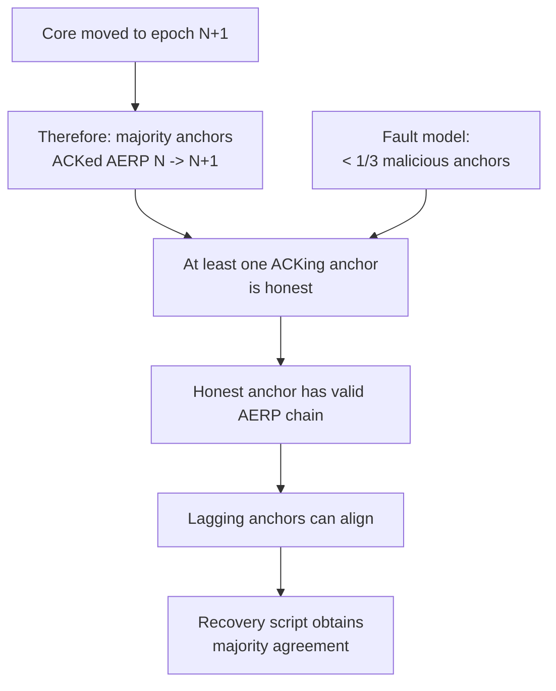
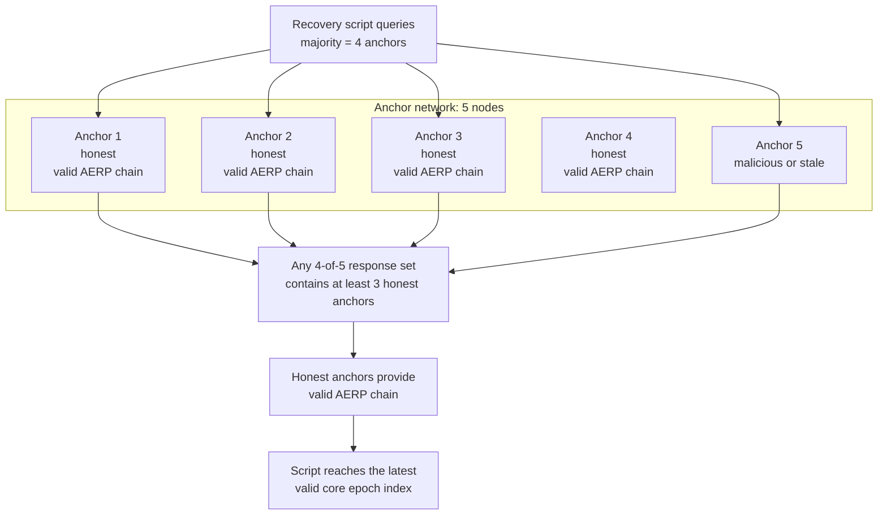
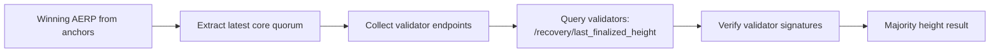
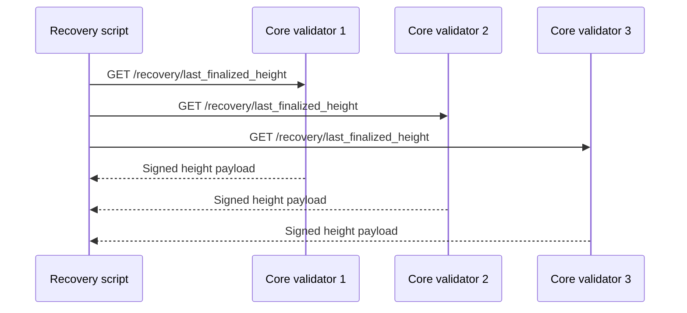
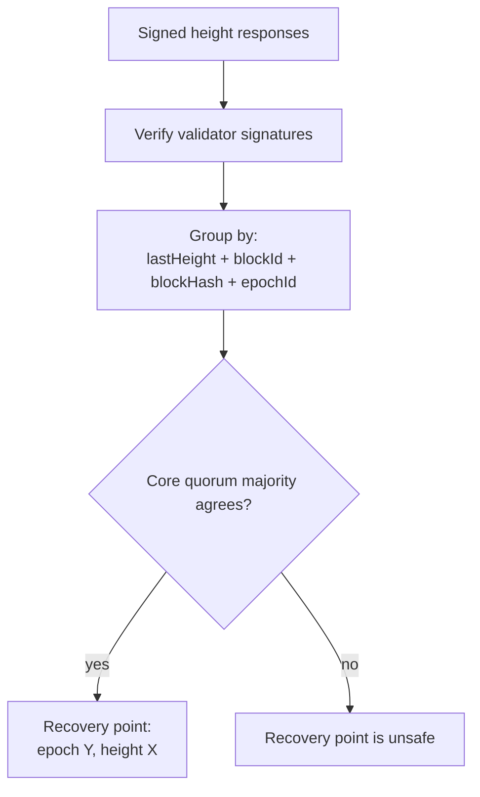
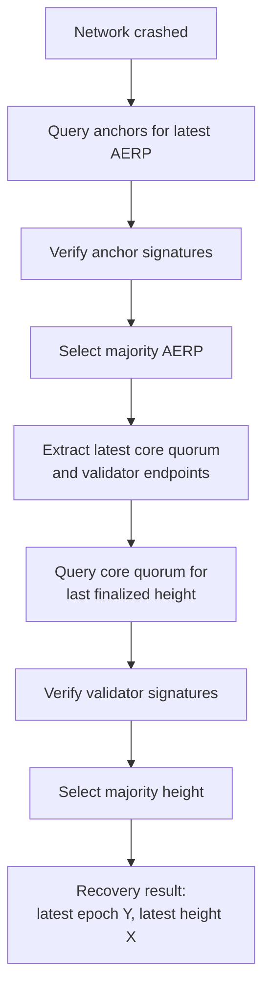

# Recovery Description

This document gives a short, schematic view of the recovery flow after a `modulr-core` network crash.

## Goal

After a crash, operators need to answer two questions:

1. What was the latest valid `modulr-core` epoch known by the network?
2. What was the latest finalized absolute height in that epoch?

Recovery uses `modulr-anchors-core` first, because anchors persist `AggregatedEpochRotationProof` data received from `modulr-core`. That proof tells us the latest known core epoch transition and the validator data needed to query the correct core quorum.

## Phase 1: Discover the Latest Core Epoch

The recovery script queries anchor nodes for their latest known core quorum data.

These queries are possible because every normal `modulr-core` epoch rotation is anchored first:

1. The core quorum builds an `AggregatedEpochRotationProof` (AERP) for epoch `N -> N+1`.
2. The core quorum sends that AERP to `modulr-anchors-core`.
3. Anchors persist the AERP and sign acknowledgements.
4. `modulr-core` waits for a majority of anchor acknowledgements.
5. Only after that majority ACK exists can the core network start sequencing blocks for epoch `N+1`.

This means the latest core epoch accepted by the running network must already be known by a majority of anchors.

The script verifies anchor signatures and groups responses by the reported `AggregatedEpochRotationProof`.

The winning AERP gives the recovery process the latest known core epoch data:

- latest epoch id
- latest epoch hash
- next quorum
- next leaders sequence
- validator HTTP/WSS endpoints collected by anchors

Under the normal fault model, recovery should eventually be able to discover this data. Since `modulr-core` requires a majority of anchor ACKs before moving to the next epoch, and less than one third of anchors are assumed malicious, that majority contains at least one honest anchor. An honest anchor can provide a valid AERP chain, allowing lagging anchors to align their local recovery state and allowing the script to obtain a majority agreement on the latest epoch.

Example with 5 anchors:

Because the core network could only enter epoch `N+1` after a majority of anchors acknowledged the AERP for `N -> N+1`, at least one honest anchor in the queried majority can provide the valid proof path. With 5 anchors and fewer than one third malicious, a majority query gives enough honest responses to recover the valid AERP chain up to the latest accepted epoch.

## Phase 2: Query the Latest Core Quorum

Once the script knows the latest core quorum, it queries those validators for their latest finalized height.

The script tries all known HTTP endpoints for each validator until one succeeds.

The script verifies validator signatures and groups responses by height payload.

## End-to-End Recovery View

## Result

The recovery script produces the two values needed to restart the network linearly:

- `Y`: the latest valid core epoch known through anchors.
- `X`: the latest finalized absolute height agreed by the latest core quorum.

Operators can then prepare node state for the next era:

1. Preserve `STATE`.
2. Reset ephemeral databases.
3. Set `CHAIN_CURSOR.EpochOffset = Y + 1`.
4. Set `CHAIN_CURSOR.Statistics.LastHeight = X`.
5. Clear `CHAIN_CURSOR.EpochDataHandler` so the new genesis initializes the next era.
6. Start the network with the new `genesis.json`.

After startup, the new era begins at absolute epoch `Y+1` and absolute height `X+1`.
