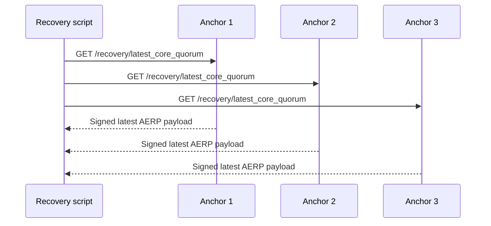
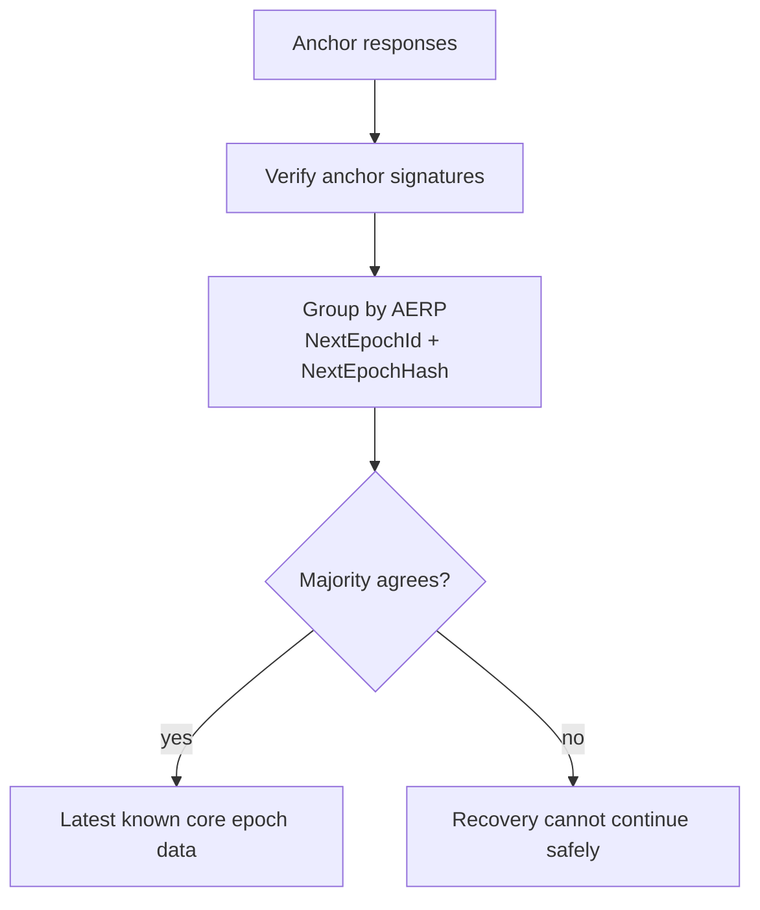
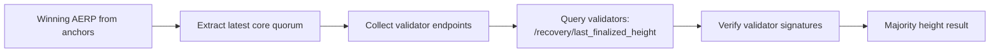
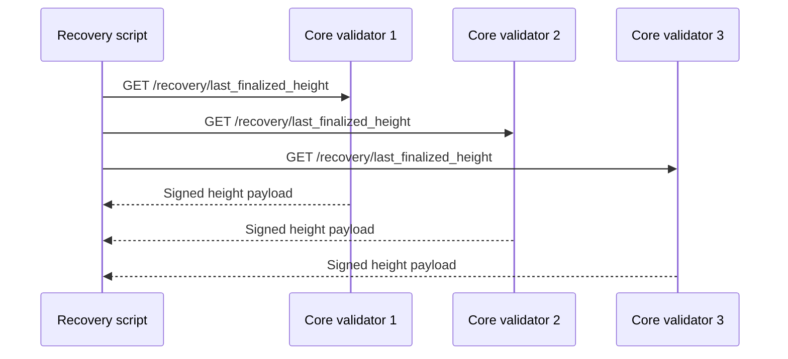
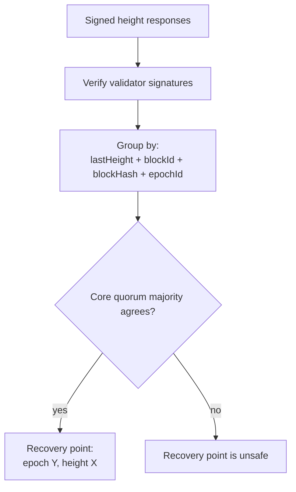
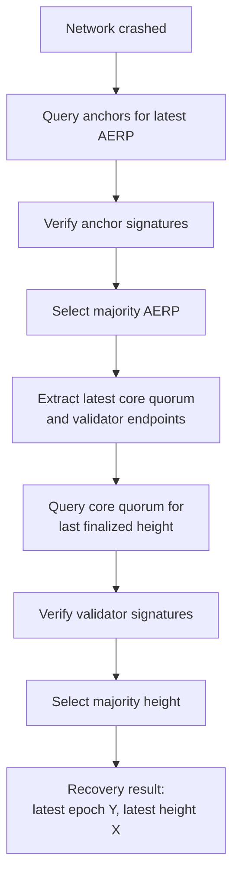

# Recovery Description

This document gives a short, schematic view of the recovery flow after a `modulr-core` network crash.

## Goal

After a crash, operators need to answer two questions:

1. What was the latest valid `modulr-core` epoch known by the network?
2. What was the latest finalized absolute height in that epoch?

Recovery uses `modulr-anchors-core` first, because anchors persist `AggregatedEpochRotationProof` data received from `modulr-core`. That proof tells us the latest known core epoch transition and the validator data needed to query the correct core quorum.

## Phase 1: Discover the Latest Core Epoch

The recovery script queries anchor nodes for their latest known core quorum data.

The script verifies anchor signatures and groups responses by the reported `AggregatedEpochRotationProof`.

The winning AERP gives the recovery process the latest known core epoch data:

- latest epoch id
- latest epoch hash
- next quorum
- next leaders sequence
- validator HTTP/WSS endpoints collected by anchors

## Phase 2: Query the Latest Core Quorum

Once the script knows the latest core quorum, it queries those validators for their latest finalized height.

The script tries all known HTTP endpoints for each validator until one succeeds.

The script verifies validator signatures and groups responses by height payload.

## End-to-End Recovery View

## Result

The recovery script produces the two values needed to restart the network linearly:

- `Y`: the latest valid core epoch known through anchors.
- `X`: the latest finalized absolute height agreed by the latest core quorum.

Operators can then prepare node state for the next era:

1. Preserve `STATE`.
2. Reset ephemeral databases.
3. Set `CHAIN_CURSOR.EpochOffset = Y + 1`.
4. Set `CHAIN_CURSOR.Statistics.LastHeight = X`.
5. Clear `CHAIN_CURSOR.EpochDataHandler` so the new genesis initializes the next era.
6. Start the network with the new `genesis.json`.

After startup, the new era begins at absolute epoch `Y+1` and absolute height `X+1`.
