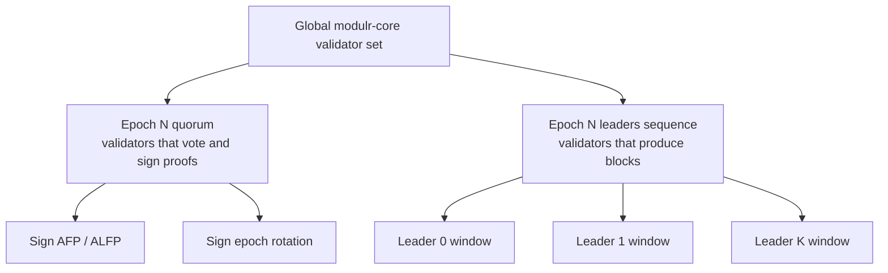
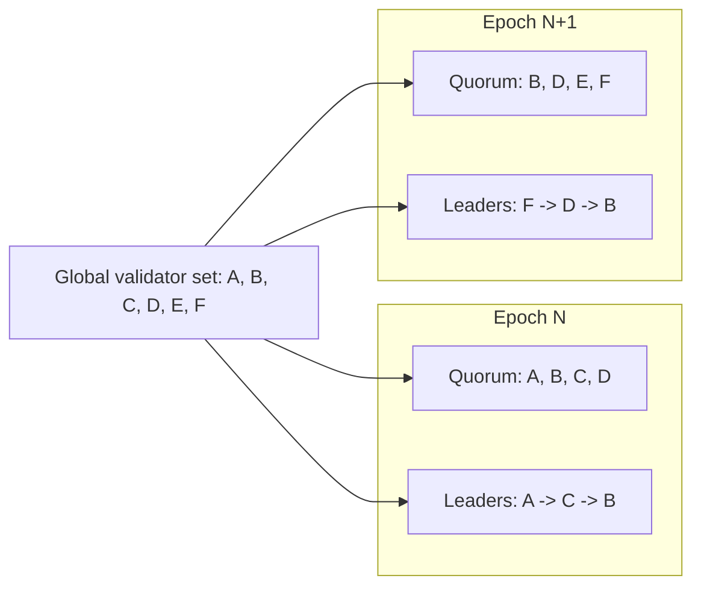
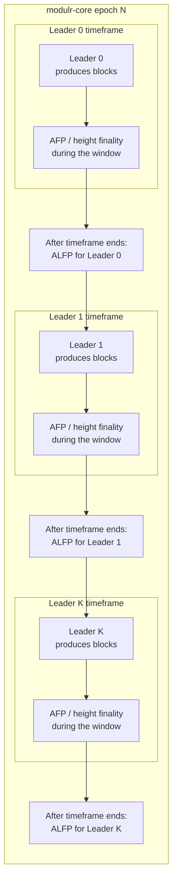
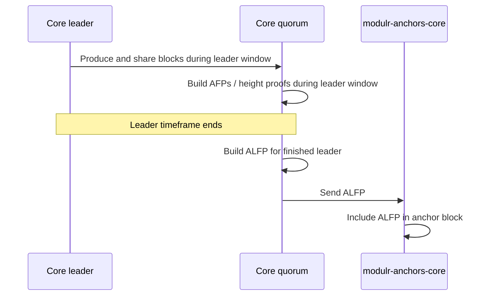
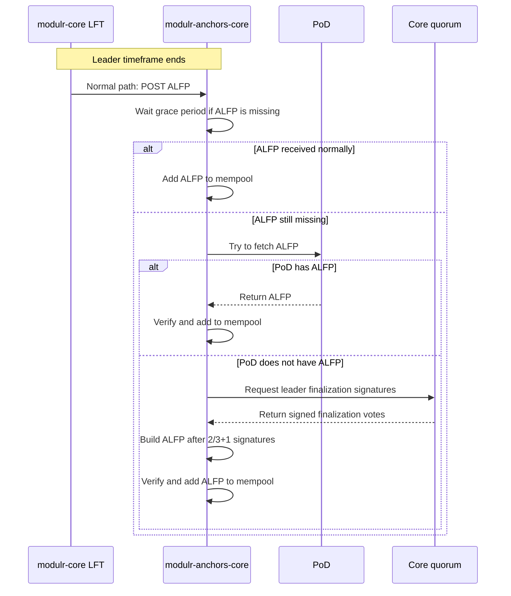
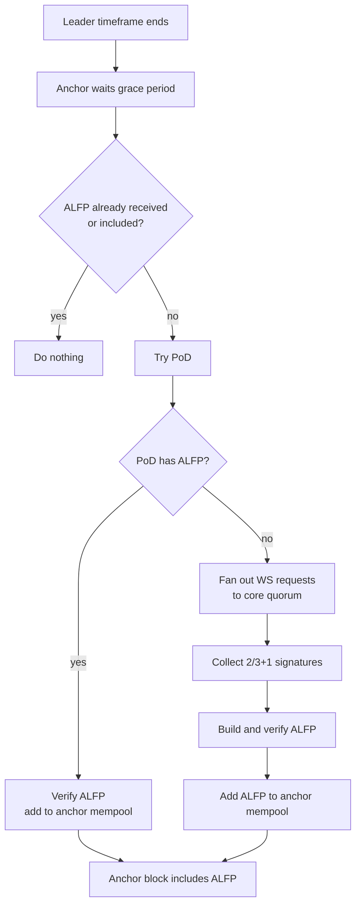
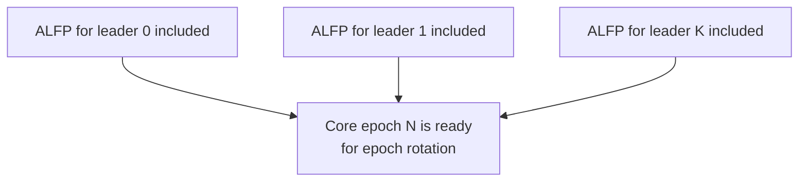
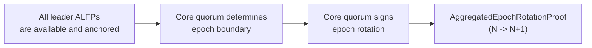
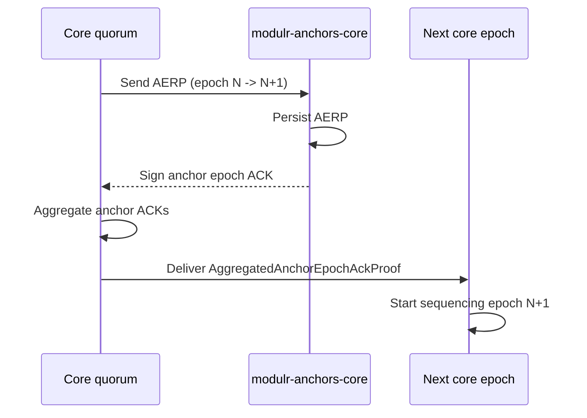
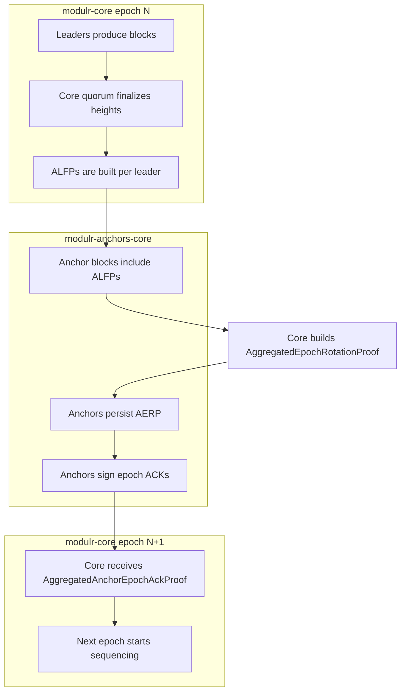

# Modulr Core and Anchors Workflow

This document gives a short, schematic view of the normal interaction between `modulr-core` and `modulr-anchors-core`.

## Why Two Networks

`modulr-core` is the execution and validator network. It produces blocks, finalizes heights, rotates leaders, and changes the validator quorum across epochs.

`modulr-anchors-core` is the anchoring network. It stores compact finality artifacts from `modulr-core` in its own blocks, so that epoch boundaries and leader finalization data are durable outside the core validator set.

The two networks do not need to have the same epoch number or leader schedule. Anchors can run independently and slightly ahead. Their job is not to execute core blocks, but to persist and acknowledge core finality data.

## Validators, Quorum, and Leaders

`modulr-core` has a global validator set. For each epoch, the protocol selects two working groups from that validator set:

1. The **epoch quorum**: validators that vote, sign finality data, and approve epoch rotation.
2. The **leaders sequence**: validators that produce blocks one by one during the epoch.

The quorum and leaders sequence are epoch-scoped. The next epoch can use a different subset and a different leader order.

## Normal Epoch Lifecycle

Within one `modulr-core` epoch, leaders rotate one by one. Each leader produces blocks during its leadership window. The core quorum can aggregate finality for individual blocks/heights during that window (AFP). The `AggregatedLeaderFinalizationProof` (ALFP) is built only after the leader's timeframe has ended, because it represents the final block for that leader.

Each AFP says: "this block/height is finalized". Each ALFP says: "for this leader in this core epoch, this is the last finalized block known by the quorum".

## Anchoring Leader Finalization

ALFPs are sent to `modulr-anchors-core` and included in anchor blocks. This gives the core network an external, durable record of leader finalization.

## Recent Changes: Proactive ALFP Requests from `modulr-anchors-core` to `modulr-core`

Historically, ALFP delivery was passive from the anchor perspective: `modulr-core` built an ALFP and pushed it to anchors. Anchors only waited for that HTTP delivery.

Recent changes added a fallback path where anchors can proactively collect missing ALFPs from the core quorum. This is not the primary path; anchors first give the normal `modulr-core` LeaderFinalizationThread a grace period after the leader timeframe ends.

If the ALFP is still missing after that grace period, an anchor:

1. Checks whether the ALFP is already in its mempool or already included in an anchor block.
2. Tries to fetch the ALFP from PoD.
3. If PoD does not have it, opens WebSocket requests to the relevant `modulr-core` quorum.
4. Collects `2/3 + 1` valid leader-finalization signatures.
5. Builds and verifies the ALFP locally.
6. Deposits the ALFP into the anchor mempool so it can be included in an anchor block.

The core finalizer can then observe that all required leaders for the epoch have their ALFPs included by anchors.

## Epoch Rotation Proof

After the core network knows the finalized boundary of the epoch, it builds an `AggregatedEpochRotationProof` (AERP). The AERP describes the transition from epoch `N` to epoch `N+1`, including the next quorum and next leader schedule.

The AERP is then sent to `modulr-anchors-core`. Anchors persist it and sign acknowledgements. The core network aggregates those anchor acknowledgements into an `AggregatedAnchorEpochAckProof`.

## End-to-End View

## Key Invariant

`modulr-core` should not treat the next epoch as fully active for sequencing until the epoch rotation has been acknowledged by a majority of anchors.

In short:

1. Core leaders produce blocks.
2. Core quorum finalizes heights.
3. Core quorum creates ALFPs for finished leaders.
4. Anchors include ALFPs in anchor blocks.
5. Core quorum creates the AERP for the next epoch.
6. Anchors persist the AERP and sign ACKs.
7. Core aggregates anchor ACKs.
8. The next core epoch starts sequencing.
